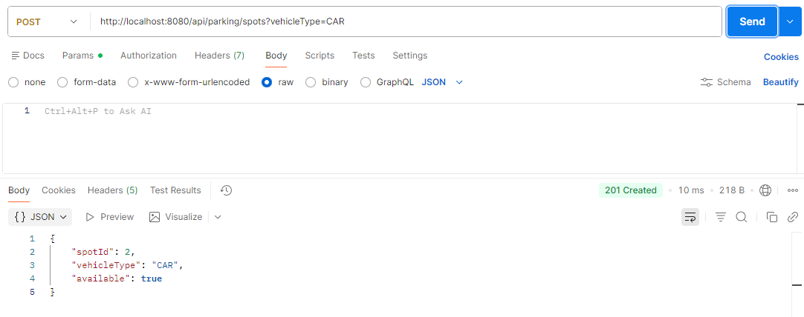
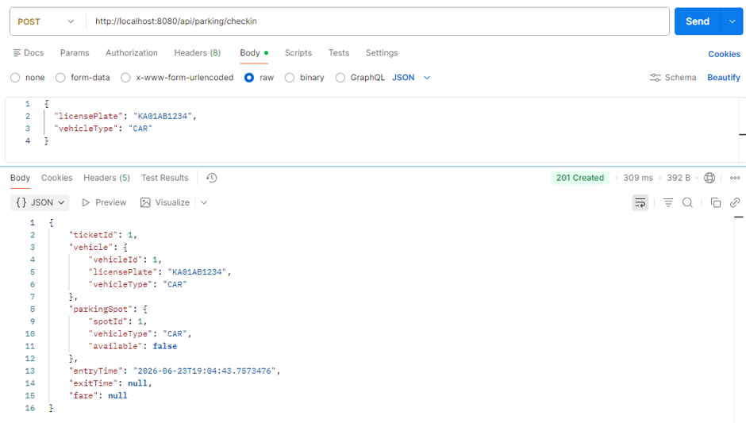
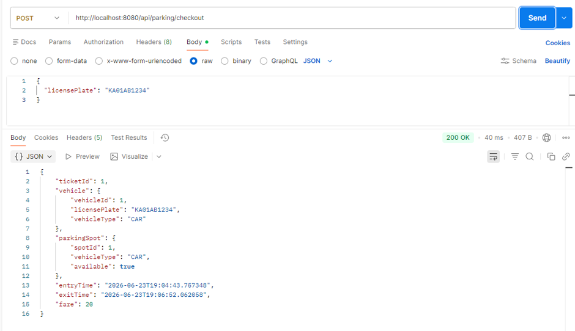
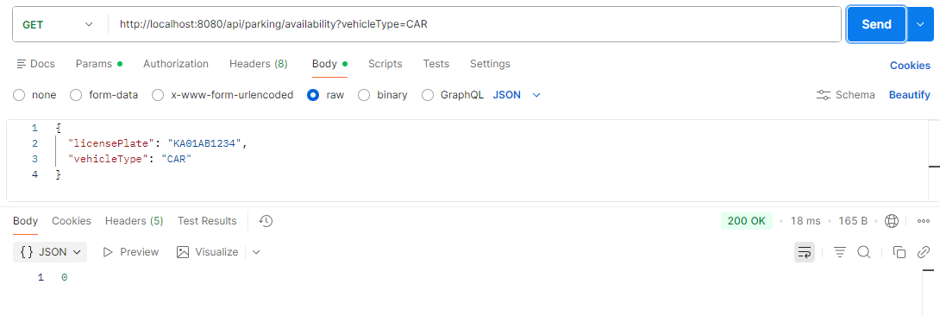
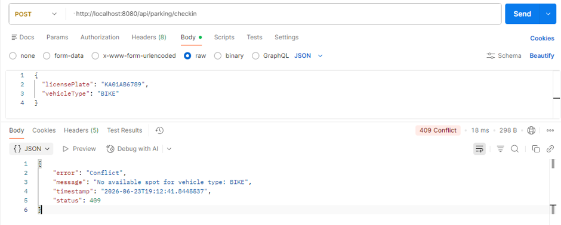
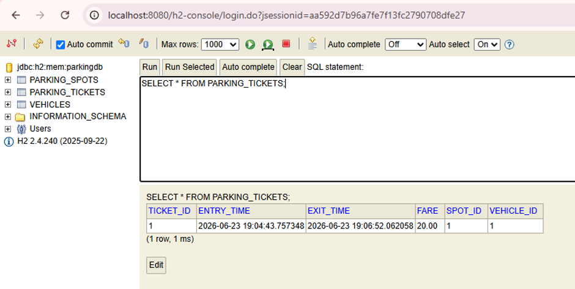
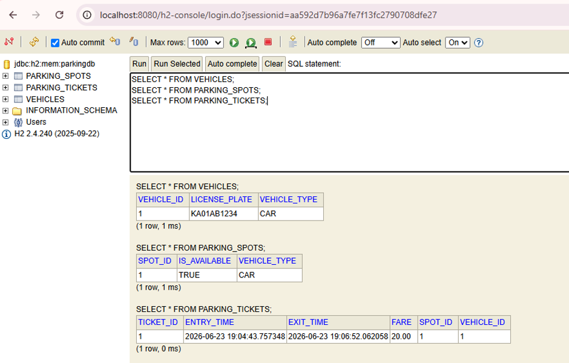

# Smart Parking Lot System

A Spring Boot backend system for managing smart parking lot operations — including vehicle check-in/check-out, automatic spot allocation by vehicle type, real-time availability tracking, and fee calculation.

This project was built as part of the Airtribe Backend Development program, focusing on Low-Level Design (LLD) principles applied to a real-world working system.

---

## Problem Statement

Design and implement a backend system for a parking lot that:
- Automatically assigns a parking spot to an incoming vehicle based on its type (bike, car, bus)
- Tracks entry and exit time for each vehicle
- Calculates parking fees based on duration and vehicle type
- Updates spot availability in real time
- Handles concurrent vehicle entries safely

---

## Tech Stack

| Layer | Technology |
|---|---|
| Language | Java 17 |
| Framework | Spring Boot |
| Build Tool | Maven |
| Database | H2 (in-memory) |
| ORM | Spring Data JPA / Hibernate |
| Testing | JUnit 5, Mockito |
| Boilerplate Reduction | Lombok |

---

## Architecture

The system follows a standard layered architecture:

```
Controller  →  Service  →  Repository  →  Database
```

```
com.airtribe.parkinglot
├── controller    → REST endpoints (HTTP layer only, no business logic)
├── service       → Business logic: allocation, fee calculation, check-in/out
├── repository    → Spring Data JPA interfaces
├── entity        → JPA entities mapped to database tables
├── dto           → Request payloads with validation
└── exception     → Custom exceptions + global exception handler
```

This separation keeps each layer responsible for exactly one concern — controllers never talk to repositories directly, and business rules live only in the service layer.

---

## Data Model

### Entities

**`Vehicle`**
| Field | Type | Notes |
|---|---|---|
| vehicleId | Long | Primary key, auto-generated |
| licensePlate | String | Unique |
| vehicleType | Enum (`BIKE`, `CAR`, `BUS`) | Stored as STRING, not ORDINAL |

**`ParkingSpot`**
| Field | Type | Notes |
|---|---|---|
| spotId | Long | Primary key, auto-generated |
| vehicleType | Enum | Type of vehicle this spot fits |
| isAvailable | boolean | Defaults to `true` on creation |

**`ParkingTicket`**
| Field | Type | Notes |
|---|---|---|
| ticketId | Long | Primary key, auto-generated |
| vehicle | `Vehicle` (Many-to-One) | The vehicle this ticket belongs to |
| parkingSpot | `ParkingSpot` (Many-to-One) | The spot assigned for this visit |
| entryTime | LocalDateTime | Set at check-in |
| exitTime | LocalDateTime | Set at check-out, null until then |
| fare | BigDecimal | Calculated at check-out, null until then |

### Why a separate `ParkingTicket` entity?

A `Vehicle` can visit the parking lot multiple times across different days. Each visit has its own entry time, exit time, and fare — so a visit is modeled as its own entity (`ParkingTicket`) rather than storing repeated visit data directly on `Vehicle`. This avoids overwriting or losing historical visit data.

### Relationships

```
Vehicle (1) ────< (Many) ParkingTicket (Many) >──── (1) ParkingSpot
```

One vehicle can have many tickets over time. One spot can be used by many tickets over time (never simultaneously).

---

## Spot Allocation Algorithm

When a vehicle checks in:

1. Filter all `ParkingSpot` records matching the vehicle's type AND marked as available
2. Assign the **first available spot** from that filtered list
3. Mark it as occupied immediately

This is a simple, deterministic O(1) selection (after the filtered query) that satisfies the brief's requirement of efficient assignment. It does not currently account for spot proximity or floor number, since the data model doesn't track floors — this could be a future extension.

---

## Fee Calculation Logic

Fare is calculated at checkout based on:

- **Duration**: time between `entryTime` and `exitTime`, rounded **up** to the next full hour (e.g., 1 hour 5 minutes is billed as 2 hours)
- **Minimum charge**: at least 1 hour is always billed, even for short stays
- **Rate per vehicle type**:

| Vehicle Type | Rate per Hour |
|---|---|
| BIKE | ₹10 |
| CAR | ₹20 |
| BUS | ₹50 |

```
fare = ratePerHour(vehicleType) × ceil(minutesParked / 60)
```

Rates are currently hardcoded in the service layer. In a production system, these would likely move to a configuration file or a dedicated pricing strategy class to allow changes without redeploying code.

---

## Concurrency Handling

**The problem:** If two vehicles check in for the same vehicle type at nearly the same instant, and only one spot is available, both requests could read the same "available" spot before either has saved their changes — resulting in both vehicles being assigned the same spot (a classic *lost update* race condition).

**The fix:**

1. **`@Transactional`** on `checkIn()` and `checkOut()` ensures each operation is atomic — if any step fails mid-way, the entire operation rolls back, leaving no partially-updated state.

2. **Pessimistic write locking** on the spot-fetching query:

```java
@Lock(LockModeType.PESSIMISTIC_WRITE)
@Query("SELECT s FROM ParkingSpot s WHERE s.vehicleType = :vehicleType AND s.isAvailable = true")
List<ParkingSpot> findAvailableSpotsForUpdate(@Param("vehicleType") VehicleType vehicleType);
```

This locks the matching spot rows in the database the moment they're read inside a transaction. Any other transaction trying to read the same rows must wait until the first transaction commits or rolls back — preventing two vehicles from ever being assigned the same spot.

This locking query is used **only** during check-in (where a spot is being claimed). The read-only `/availability` endpoint uses a separate, unlocked query, since locking is unnecessary overhead for data that's just being displayed, not modified.

---

## API Endpoints

### Create a parking spot (admin/setup)
```
POST /api/parking/spots?vehicleType=CAR
```
Response: `201 Created`
```json
{
  "spotId": 1,
  "vehicleType": "CAR",
  "available": true
}
```


### Check in a vehicle
```
POST /api/parking/checkin
Content-Type: application/json

{
  "licensePlate": "KA01AB1234",
  "vehicleType": "CAR"
}
```
Response: `201 Created`
```json
{
  "ticketId": 1,
  "vehicle": { "vehicleId": 1, "licensePlate": "KA01AB1234", "vehicleType": "CAR" },
  "parkingSpot": { "spotId": 1, "vehicleType": "CAR", "available": false },
  "entryTime": "2026-06-21T22:00:59.93",
  "exitTime": null,
  "fare": null
}
```


### Check out a vehicle
```
POST /api/parking/checkout
Content-Type: application/json

{
  "licensePlate": "KA01AB1234"
}
```
Response: `200 OK`
```json
{
  "ticketId": 1,
  "vehicle": { "vehicleId": 1, "licensePlate": "KA01AB1234", "vehicleType": "CAR" },
  "parkingSpot": { "spotId": 1, "vehicleType": "CAR", "available": true },
  "entryTime": "2026-06-21T22:00:59.93",
  "exitTime": "2026-06-21T22:01:37.95",
  "fare": 20
}
```


### Check real-time availability
```
GET /api/parking/availability?vehicleType=CAR
```
Response: `200 OK`
```json
2
```


### Error response example (no spot available)
```json
{
  "timestamp": "2026-06-21T22:05:00",
  "status": 409,
  "error": "Conflict",
  "message": "No available spot for vehicle type: CAR"
}
```


---

## Error Handling

A centralized `@RestControllerAdvice` (`GlobalExceptionHandler`) converts custom exceptions into clean, consistent JSON error responses instead of generic stack traces:

| Exception | HTTP Status | Scenario |
|---|---|---|
| `NoSpotAvailableException` | 409 Conflict | No spot of the requested type is free |
| `TicketNotFoundException` | 404 Not Found | Vehicle or active ticket doesn't exist |
| `MethodArgumentNotValidException` | 400 Bad Request | Request body fails validation (e.g., blank license plate) |

---

## Running the Project

1. Clone the repository
2. Open in IntelliJ (or run via terminal)
3. Run the application:
   ```
   ./mvnw spring-boot:run
   ```
4. Server starts on `http://localhost:8080`
5. H2 console available at `http://localhost:8080/h2-console`
    - JDBC URL: `jdbc:h2:mem:parkingdb`
    - Username: `sa`
    - Password: *(leave blank)*





---

## Testing

Unit tests cover the `ParkingService` business logic using JUnit 5 and Mockito, with repositories mocked to isolate logic from the database:

- Check-in succeeds when a spot is available
- Check-in throws `NoSpotAvailableException` when no spot is free
- Check-out calculates fare correctly and frees the spot
- Check-out throws `TicketNotFoundException` for unregistered vehicles
- Check-out throws `TicketNotFoundException` when no active ticket exists
- Availability count returns the correct number of free spots

Run tests with:
```
./mvnw test
```

---

## Possible Future Improvements

- Add `floor` field to `ParkingSpot` for multi-level allocation logic (nearest spot, lowest floor first)
- Move pricing rates to `application.properties` or a dedicated pricing strategy class
- Add pagination to a "list all tickets" endpoint for admin reporting
- Add integration tests using `@SpringBootTest` against the real H2 database, in addition to the current unit tests